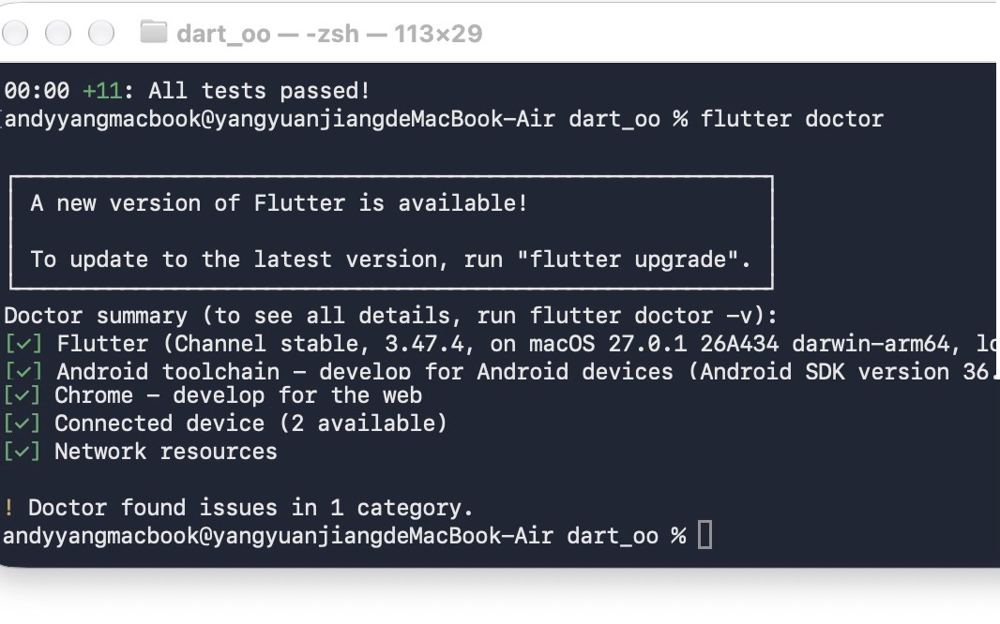
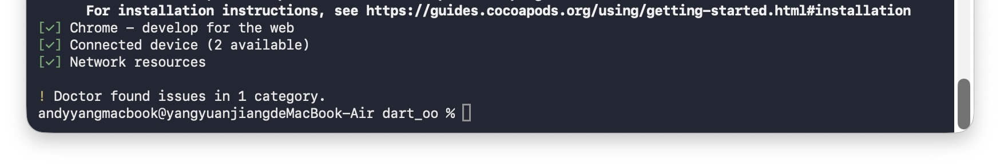

# 进度报告3（第5周·Dart语言基础二：面向对象与集合）

> 使用方式：在模板上作答，作答完成后将全文复制到雨课堂答题区（图片无法粘贴时在雨课堂编辑器中手工重新上传），并将同一内容存入自己仓库 lecture3/progress.md。

## 一、任务理解

用自己的话说明本次作业要完成什么、验收标准是什么。

要完成案例复习和自主实践，涉及到类的设计，mixin 改造，集合统计链，test 功能。验收标准是 dart test 全绿，git 提交记录完整。

## 二、环境与工具

本次使用的开发环境、运行目标（Web/模拟器/真机）与 AI 工具版本。

开发环境：dart SDK。运行目标：所写的类能够实现 test 的功能并且做到全绿。AI 工具：TraeCode。

## 三、过程记录

按时间线记录主要操作步骤（安装、创建、修改、运行）。

确认主题，预想功能 → `dart create` 文件夹 → `lib` 新建文件 → 创建需要的类，并且实现相关的功能 → 跑 `dart test`。

## 四、关键代码

粘贴 1 至 3 段关键代码并逐行解释（注明是否 AI 生成、如何验证）。

```dart
Rocket.fromJson(Map<String, dynamic> json) // 这是通过 json 数据去完成对象的构建
    : name = json['name'],
      _payload = (json['payload'] as num).toDouble() {
  if (_payload <= 0) throw ArgumentError("运载能力必须大于 0"); // 检查：运载能力的范围是否正确
}
```

说明：这段代码是仿照 guide 里面的 Student 类写的，并非 AI 生成。通过 `dart test` 中 `fromJson` 越界用例验证异常被正确抛出，合法用例验证对象构建成功。

## 五、检查点结果

统计输出正确；测试全部通过。附证据说明。

### 案例复现

```
ndyyangmacbook@yangyuanjiangdeMacBook-Air dart_oo % dart test
00:00 +0: test/gradebook_test.dart: 正常数据统计正确 平均分计算正确
========== 创建成绩单 ==========
00:00 +1: test/gradebook_test.dart: 正常数据统计正确 平均分计算正确 00:00 +1: test/gradebook_test.dart: 正常数据统计正确 平均分计算正确
[17:04:22] LOG: 开始执行：创建成绩单
[17:04:22] LOG: 共提取5个学生的成绩
00:00 +2: test/gradebook_test.dart: 正常数据统计正确 平均分计算正确 00:00 +2: test/gradebook_test.dart: 正常数据统计正确 最高分学生正确 00:00 +2: test/gradebook_test.dart: 正常数据统计正确 最高分学生正确
========== 创建成绩单 ==========
[17:04:22] LOG: 开始执行：创建成绩单
[17:04:22] LOG: 共提取5个学生的成绩
[17:04:22] LOG: 最高分学生：小明 - 95.0分
00:00 +3: test/gradebook_test.dart: 正常数据统计正确 最高分学生正确 00:00 +3: test/gradebook_test.dart: 正常数据统计正确 及格人数正确（>=60 的有 4 个） 00:00 +3: test/gradebook_test.dart: 正常数据统计正确 及格人数正确（>=60 的有 4 个）
========== 创建成绩单 ==========
[17:04:22] LOG: 开始执行：创建成绩单
[17:04:22] LOG: 共提取5个学生的成绩
00:00 +4: test/gradebook_test.dart: 正常数据统计正确 及格人数正确（>=60 的有 4 个） 00:00 +4: test/gradebook_test.dart: 正常数据统计正确 分档人数正确（优1 / 良2 / 不及格2） 00:00 +4: test/gradebook_test.dart: 正常数据统计正确 分档人数正确（优1 / 良2 / 不及格2）
========== 创建成绩单 ==========
[17:04:22] LOG: 开始执行：创建成绩单
[17:04:22] LOG: 共提取5个学生的成绩
========== 按成绩分档 ==========
[17:04:22] LOG: 开始执行：按成绩分档
[17:04:22] LOG: 优：1人 | 良：2人 | 不及格：2人
00:00 +5: test/gradebook_test.dart: 正常数据统计正确 分档人数正确（优1 / 良2 / 不及格2） 00:00 +5: test/gradebook_test.dart: 正常数据统计正确 分数列表 gradebook 已正确提取 00:00 +5: test/gradebook_test.dart: 正常数据统计正确 分数列表 gradebook 已正确提取
========== 创建成绩单 ==========
[17:04:22] LOG: 开始执行：创建成绩单
[17:04:22] LOG: 共提取5个学生的成绩
00:00 +6: test/gradebook_test.dart: 正常数据统计正确 分数列表 gradebook 已正确提取 00:00 +6: test/gradebook_test.dart: 正常数据统计正确 空列表时 maxBy 返回 null、average 为 0 00:00 +6: test/gradebook_test.dart: 正常数据统计正确 空列表时 maxBy 返回 null、average 为 0
========== 创建成绩单 ==========
[17:04:22] LOG: 开始执行：创建成绩单
[17:04:22] LOG: 共提取5个学生的成绩
========== 创建成绩单 ==========
[17:04:22] LOG: 开始执行：创建成绩单
[17:04:22] LOG: 共提取0个学生的成绩
[17:04:22] LOG: 学生列表为空，没有最高分
00:00 +7: test/gradebook_test.dart: 正常数据统计正确 空列表时 maxBy 返回 null、average 为 0 00:00 +7: test/gradebook_test.dart: 越界分数抛异常 构造函数 >100 抛 ArgumentError 00:00 +8: test/gradebook_test.dart: 越界分数抛异常 构造函数 >100 抛 ArgumentError 00:00 +8: test/gradebook_test.dart: 越界分数抛异常 构造函数 <0 抛 ArgumentError 00:00 +9: test/gradebook_test.dart: 越界分数抛异常 构造函数 <0 抛 ArgumentError 00:00 +9: test/gradebook_test.dart: 越界分数抛异常 fromJson 越界抛 ArgumentError 00:00 +10: test/gradebook_test.dart: 越界分数抛异常 fromJson 越界抛 ArgumentError 00:00 +10: test/gradebook_test.dart: 越界分数抛异常 setter 赋值越界抛 ArgumentError 00:00 +11: test/gradebook_test.dart: 越界分数抛异常 setter 赋值越界抛 ArgumentError 00:00 +11: test/gradebook_test.dart: 越界分数抛异常 setter 赋值在合法范围不抛异常 00:00 +12: test/gradebook_test.dart: 越界分数抛异常 setter 赋值在合法范围不抛异常 00:00 +12: All tests passed!
```

### 自主实践

```
andyyangmacbook@yangyuanjiangdeMacBook-Air dart_oo % dart test test/rocket_test.dart
00:00 +0: 正常数据统计正确 payloads 运载能力列表正确提取 00:00 +1: 正常数据统计正确 payloads 运载能力列表正确提取 00:00 +1: 正常数据统计正确 maxRocket 最大火箭正确（土星5号 140.0） 00:00 +2: 正常数据统计正确 maxRocket 最大火箭正确（土星5号 140.0） 00:00 +2: 正常数据统计正确 sortAscending 升序正确（最小在最前：电子号 0.3） 00:00 +3: 正常数据统计正确 sortAscending 升序正确（最小在最前：电子号 0.3） 00:00 +3: 正常数据统计正确 sortDescending 降序正确（最大在最前：土星5号） 00:00 +4: 正常数据统计正确 sortDescending 降序正确（最大在最前：土星5号） 00:00 +4: 正常数据统计正确 wherePayloadAtLeast(20) 筛选载重>=20吨的有 3 枚 00:00 +5: 正常数据统计正确 wherePayloadAtLeast(20) 筛选载重>=20吨的有 3 枚 00:00 +5: 正常数据统计正确 集合统计链 heavyRocketReport：>=5个链式方法组合 00:00 +6: 正常数据统计正确 集合统计链 heavyRocketReport：>=5个链式方法组合 00:00 +6: 正常数据统计正确 mixin Spacecraft 能力可用：isHeavyPayload / summary 00:00 +7: 正常数据统计正确 mixin Spacecraft 能力可用：isHeavyPayload / summary 00:00 +7: 正常数据统计正确 空列表边界：maxRocket 返回 null 00:00 +8: 正常数据统计正确 空列表边界：maxRocket 返回 null 00:00 +8: 越界分数抛异常 构造函数 payload <= 0 抛 ArgumentError 00:00 +9: 越界分数抛异常 构造函数 payload <= 0 抛 ArgumentError 00:00 +9: 越界分数抛异常 fromJson 越界抛 ArgumentError 00:00 +10: 越界分数抛异常 fromJson 越界抛 ArgumentError 00:00 +10: 越界分数抛异常 setter 赋值 <= 0 抛 ArgumentError，合法值正常 00:00 +11: 越界分数抛异常 setter 赋值 <= 0 抛 ArgumentError，合法值正常 00:00 +11: All tests passed!
```

## 六、问题与调试

遇到的问题、定位过程、解决方案（至少 1 条真实记录）。

**问题**：`dart test` 跑不通。

**定位**：在案例复现的时候，错误的把 test 文件的名字结尾没有写成 `_test.dart` 结尾，导致 test 不能正常识别到这个文件。

**解决**：查阅 guide 指导后，规范了命名的格式，问题得到解决。

## 七、AI 使用记录

TraeCode 使用清单（用途、指令摘要、输出、本人验证方式）。

- **用途**：我注释写清楚要实现的功能，把函数名写出来，TraeCode 去实现具体的函数内容。
- **指令摘要**：写中文注释描述函数行为 + 函数签名 → 由 TraeCode 补全函数体。
- **输出**：得到函数实现代码。
- **本人验证方式**：检查报错和运行 `dart test`，全部用例通过为准。

## 八、证据截图

运行截图、flutter doctor 或控制台输出、Git 提交记录（每图配一句话说明）。



*图 1：flutter doctor 顶部输出，显示 Flutter 3.47.4（stable）在 macOS 27.0.1 darwin-arm64 上运行，提示有更新版本可用。*



*图 2：flutter doctor 完整截图：Chrome / Connected device（2 available）/ Network resources 均正常，仅 1 个 category 提示可升级。*

## 九、自评

对照本次作业要求逐项自查完成情况。

选做部分取学习了解了，但是没有写进报告。

## 十、一句话收获与下一步计划

本课一句话收获；遗留问题与下次课的预习要点。

学习了雷河对象的概念机用法，遗留问题：还不能自己完成整个项目的代码，得借助 AI 工具。